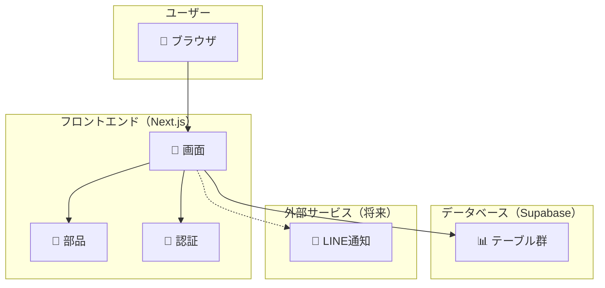
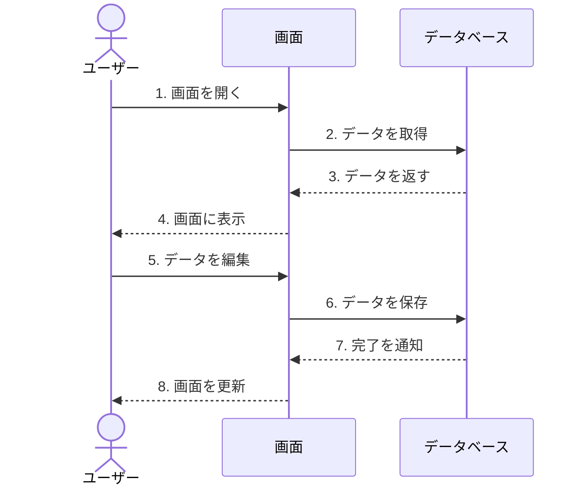
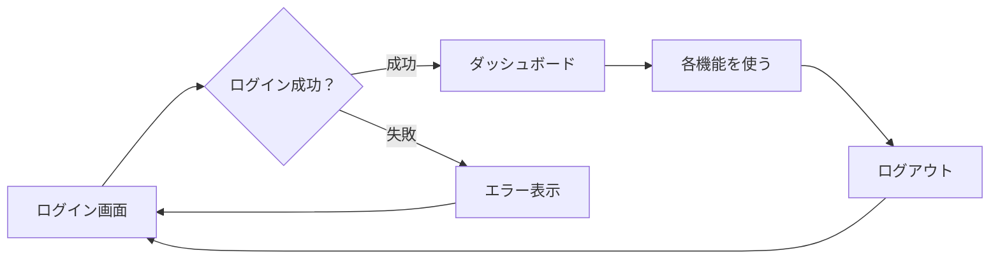
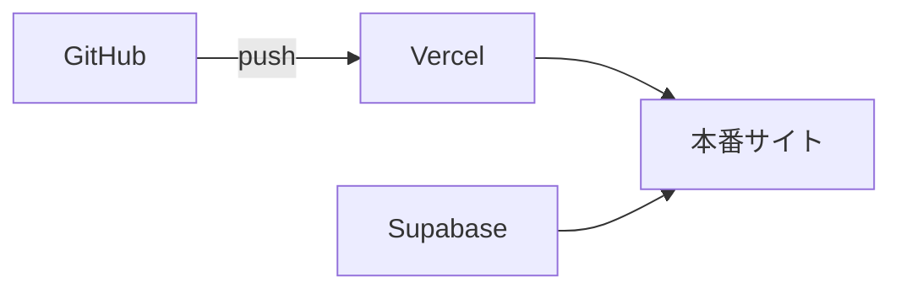

# Business Manager v1.0 - システム構成図

> 作成日: 2024年12月14日  
> バージョン: 1.0

## 🏗️ 全体構成

このアプリは以下のような構成になっています。



---

## 📁 フォルダ構成

```
business-manager-next/
├── src/
│   ├── app/                    # 画面（ページ）
│   │   ├── page.tsx            # ダッシュボード
│   │   ├── tasks/              # タスク管理
│   │   ├── customers/          # 顧客管理
│   │   ├── tickets/            # チケット管理
│   │   ├── accounting/         # 経理
│   │   ├── lending/            # 貸し借り
│   │   ├── businesses/         # 事業管理
│   │   ├── users/              # ユーザー管理
│   │   └── api/                # API（サーバー処理）
│   │       └── line-notify/    # LINE通知API
│   │
│   ├── components/             # 再利用できる部品
│   │   ├── AppLayout.tsx       # 全体のレイアウト
│   │   ├── Header.tsx          # ヘッダー
│   │   ├── Sidebar.tsx         # サイドメニュー
│   │   ├── LoginForm.tsx       # ログイン画面
│   │   └── ui/                 # 汎用UI部品
│   │       ├── Button.tsx      # ボタン
│   │       ├── DataTable.tsx   # データ表
│   │       └── Modal.tsx       # ポップアップ
│   │
│   ├── lib/                    # 共通機能
│   │   ├── auth.tsx            # 認証処理
│   │   ├── db.ts               # データ操作
│   │   ├── supabase.ts         # DB接続
│   │   └── line-notify.ts      # LINE通知
│   │
│   ├── types/                  # データの型定義
│   │   └── index.ts            # 全データ型
│   │
│   └── styles/                 # デザイン
│       └── globals.css         # 共通スタイル
│
├── docs/                       # ドキュメント
│   └── v1.0/                   # バージョン1.0
│
├── supabase-schema.sql         # データベース設計
├── env.example                 # 環境設定のサンプル
└── package.json                # 依存パッケージ
```

---

## 🔄 データの流れ

ユーザーが操作すると、以下のようにデータが流れます。



---

## 🔐 認証の流れ



---

## 🛠️ 使用技術

| カテゴリ | 技術 | 説明 |
|---------|------|------|
| フレームワーク | Next.js 15 | Reactベースのフレームワーク |
| 言語 | TypeScript | 型付きのJavaScript |
| データベース | Supabase | PostgreSQLベースのBaaS |
| スタイル | CSS | 独自のCSSスタイル |
| 通知（予定） | LINE Notify | LINE通知API |

---

## 🌐 本番環境へのデプロイ

Vercelを使うと、GitHubと連携して自動デプロイできます。



**手順：**
1. Vercelにログイン
2. GitHubリポジトリを連携
3. 環境変数を設定
4. デプロイ完了！
