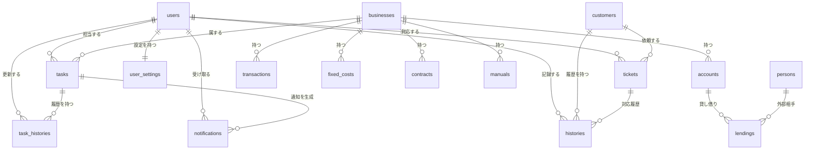

# Business Manager v1.0 - データベース設計

> 作成日: 2024年12月14日  
> バージョン: 1.0

## 📊 ER図（データの関係図）

以下の図は、各データ（テーブル）がどのように関連しているかを示しています。

---

## 📋 テーブル一覧

### 👤 ユーザー関連

#### users（ユーザー）
システムを使う人の情報です。

| 項目 | 日本語名 | 説明 |
|------|---------|------|
| id | ID | 自動で付く番号 |
| name | 名前 | ユーザーの名前 |
| email | メールアドレス | ログインに使う（重複不可） |
| password | パスワード | ログインに使う |
| is_admin | 管理者フラグ | 管理者かどうか |
| created_at | 作成日時 | 登録した日時 |

#### user_settings（ユーザー設定）
各ユーザーの個別設定です。

| 項目 | 日本語名 | 説明 |
|------|---------|------|
| id | ID | 自動で付く番号 |
| user_id | ユーザーID | どのユーザーの設定か |
| line_notify_token | LINEトークン | LINE通知用のトークン |
| notify_hours_before | 通知タイミング | 何時間前に通知するか |

---

### 🏢 事業関連

#### businesses（事業）
管理する事業の情報です。

| 項目 | 日本語名 | 説明 |
|------|---------|------|
| id | ID | 自動で付く番号 |
| name | 事業名 | 事業の名前 |
| description | 説明 | 事業の説明 |
| is_shared | 共有フラグ | 全員で共有するか |

---

### ✅ タスク関連

#### tasks（タスク）
やるべきことの情報です。

| 項目 | 日本語名 | 説明 |
|------|---------|------|
| id | ID | 自動で付く番号 |
| title | タイトル | タスクの件名 |
| description | 説明 | 詳しい内容 |
| user_id | 担当者ID | 誰のタスクか |
| business_id | 事業ID | どの事業のタスクか |
| status | ステータス | 未着手/進行中/完了 |
| priority | 優先度 | high/medium/low |
| due_date | 期限 | いつまでにやるか |
| show_after | 表示開始日時 | この日時まで非表示（リマインダー） |
| notify_hours_before | 通知タイミング | 期限の何時間前に通知 |
| created_at | 作成日時 | 作成した日時 |

#### task_histories（タスク履歴）
タスクの変更履歴です。

| 項目 | 日本語名 | 説明 |
|------|---------|------|
| id | ID | 自動で付く番号 |
| task_id | タスクID | どのタスクの履歴か |
| action | アクション | created/status/memo/reminder/assignee |
| description | 説明 | 何をしたか |
| user_id | 操作者ID | 誰が操作したか |
| created_at | 作成日時 | 操作した日時 |

#### notifications（通知）
ユーザーへの通知です。

| 項目 | 日本語名 | 説明 |
|------|---------|------|
| id | ID | 自動で付く番号 |
| type | 種類 | task_update/task_overdue/task_reminder |
| task_id | タスクID | 関連するタスク |
| user_id | 宛先ID | 誰への通知か |
| message | メッセージ | 通知の内容 |
| is_read | 既読フラグ | 読んだかどうか |
| created_at | 作成日時 | 通知した日時 |

---

### 👥 顧客関連

#### customers（顧客）
取引先・顧客の情報です。

| 項目 | 日本語名 | 説明 |
|------|---------|------|
| id | ID | 自動で付く番号 |
| name | 名前 | 顧客の名前 |
| phone | 電話番号 | 連絡先電話番号 |
| email | メールアドレス | 連絡先メール |
| address | 住所 | 住所 |
| memo | メモ | 自由記入欄 |

#### tickets（チケット）
顧客からの依頼・問い合わせです。

| 項目 | 日本語名 | 説明 |
|------|---------|------|
| id | ID | 自動で付く番号 |
| title | タイトル | 依頼の件名 |
| description | 説明 | 詳しい内容 |
| customer_id | 顧客ID | どの顧客からか |
| assigned_user_id | 担当者ID | 誰が対応するか |
| source | 対応元 | phone/email/web/other |
| status | ステータス | 新規/対応中/保留/完了 |
| created_at | 作成日時 | 作成した日時 |

#### histories（対応履歴）
顧客対応の記録です。

| 項目 | 日本語名 | 説明 |
|------|---------|------|
| id | ID | 自動で付く番号 |
| customer_id | 顧客ID | どの顧客か |
| ticket_id | チケットID | 関連するチケット |
| content | 内容 | 何をしたか |
| user_id | 対応者ID | 誰が対応したか |
| created_at | 作成日時 | 対応した日時 |

---

### 💰 経理関連

#### accounts（口座）
社内の口座・財布です。

| 項目 | 日本語名 | 説明 |
|------|---------|------|
| id | ID | 自動で付く番号 |
| name | 口座名 | 口座の名前 |
| business_id | 事業ID | どの事業のか |

#### persons（外部相手）
お金の貸し借りをする外部の人です。

| 項目 | 日本語名 | 説明 |
|------|---------|------|
| id | ID | 自動で付く番号 |
| name | 名前 | 相手の名前 |
| memo | メモ | 備考 |

#### lendings（貸し借り）
お金の貸し借り記録です。

| 項目 | 日本語名 | 説明 |
|------|---------|------|
| id | ID | 自動で付く番号 |
| account_id | 口座ID | どの口座から |
| counterparty_type | 相手タイプ | account/person |
| counterparty_id | 相手ID | 相手のID |
| type | 種類 | lend/borrow/return |
| amount | 金額 | いくら |
| date | 日付 | いつ |
| memo | メモ | 備考 |
| returned | 返済済み | 返済したかどうか |
| original_id | 元取引ID | 返済の元になった取引 |
| created_at | 作成日時 | 記録した日時 |

#### transactions（取引）
売上・経費の記録です。

| 項目 | 日本語名 | 説明 |
|------|---------|------|
| id | ID | 自動で付く番号 |
| type | 種類 | income/expense |
| business_id | 事業ID | どの事業の取引か |
| category | カテゴリ | 分類名 |
| amount | 金額 | いくら |
| date | 日付 | いつ |
| memo | メモ | 備考 |
| fixed_cost_id | 固定費ID | 固定費から自動作成された場合 |
| created_at | 作成日時 | 記録した日時 |

#### fixed_costs（固定費）
毎月発生する固定費の設定です。

| 項目 | 日本語名 | 説明 |
|------|---------|------|
| id | ID | 自動で付く番号 |
| business_id | 事業ID | どの事業の固定費か |
| category | カテゴリ | 分類名 |
| amount | 金額 | 毎月いくら |
| day_of_month | 日付 | 毎月何日に発生 |
| memo | メモ | 備考 |
| is_active | 有効フラグ | 現在使用中か |

#### categories（カテゴリ）
売上・経費のカテゴリマスタです。

| 項目 | 日本語名 | 説明 |
|------|---------|------|
| id | ID | 自動で付く番号 |
| type | 種類 | income/expense |
| name | 名前 | カテゴリ名 |

---

### 📄 ドキュメント関連

#### contracts（契約書）
契約書の情報です。

| 項目 | 日本語名 | 説明 |
|------|---------|------|
| id | ID | 自動で付く番号 |
| business_id | 事業ID | どの事業の契約か |
| name | 契約名 | 契約の名前 |
| memo | メモ | 備考 |
| file_name | ファイル名 | 添付ファイル名 |
| created_at | 作成日時 | 登録した日時 |

#### manuals（マニュアル）
業務マニュアルです。

| 項目 | 日本語名 | 説明 |
|------|---------|------|
| id | ID | 自動で付く番号 |
| business_id | 事業ID | どの事業のマニュアルか |
| name | 名前 | マニュアルの名前 |
| content | 内容 | マニュアルの本文 |
| created_at | 作成日時 | 作成した日時 |
